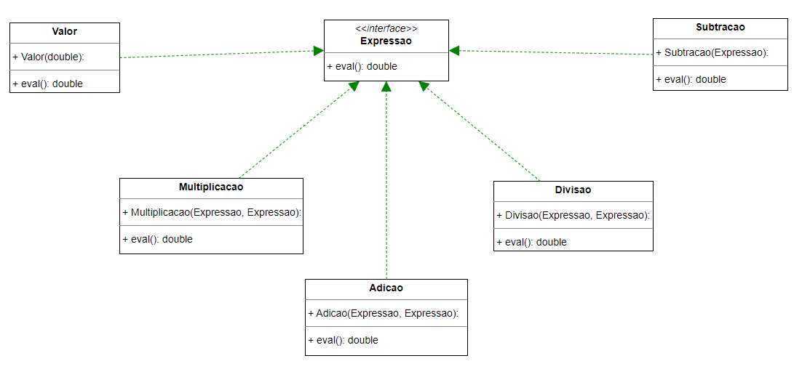

# Expressões matemáticas

Projeto acadêmico para demonstração de como montar formulas matemáticas por meio de classes que implementam interfaces
seladas


# Diagrama de Classes




# Exemplo de Uso


```java (6 + 7) * -8/2 = -52
package br.com.benefrancis;

import br.com.benefrancis.model.*;

public class Main {
    
    public static void main(String[] args) {
        
        System.out.print(" (6 + 7) * -8/2 = ");

        //(6 + 7) * -8/2
        System.out.println(
                new Multiplicacao(
                new Adicao(new Valor(6), new Valor(7)),
                new Divisao(new Subtracao(new Valor(8)), new Valor(2))
            ).eval()
         );

    }
}
```


 